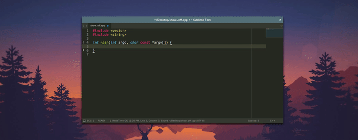

# EasyClangComplete #

Sublime Text 3 plugin that offers clang-based auto-completion for C, C++,
Objective-C, and Objective-C++.



# Simple setup! #
You are just three simple steps away!

## 1. Install this plugin ##
- Best is to use [Package Control](https://packagecontrol.io/installation)
  + <kbd>CTRL</kbd>+<kbd>Shift</kbd>+<kbd>P</kbd> and install
    `EasyClangComplete`

## 2. Install clang ##
- **Ubuntu**        : `sudo apt-get install clang`
- **OSX**           : ships `clang` by default. You are all set!
- **Windows**       : install the latest release from clang website.
  + **WARNING**: there seems to be a bug with `libclang` when using clang 4.0.
    Please install 3.9 on Windows for now.
- **Other Systems** : use your package manager or install from clang website.
- clang website: http://llvm.org/releases/download.html

## 3. Configure your includes ##

### Using CMake? ###
Plugin will run cmake on a proper `CMakeLists.txt` in your project folder and
will use information from it to complete your code out of the box. You're all
set!

### Have a compilation database? ###
Plugin will search for a compilation database `compile_commands.json` in the
project folder and will load it to complete your code.

If you want to specify a custom path to a comilation database you can do it in settings:
```json
"flags_sources": [
    {"file": "compile_commands.json", "search_in": "<YOUR_PATH>"},
]
```

### None of the above? ###
You will need a little bit of manual setup for now. Please see the following
[instructions][no_cmake].

# You're all set! #
For more information please refer to the [GitHub][github_page] page.

[no_cmake]: https://github.com/niosus/EasyClangComplete#none-of-the-above
[github_page]: https://github.com/niosus/EasyClangComplete
